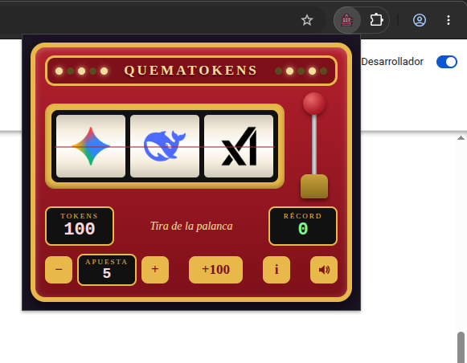
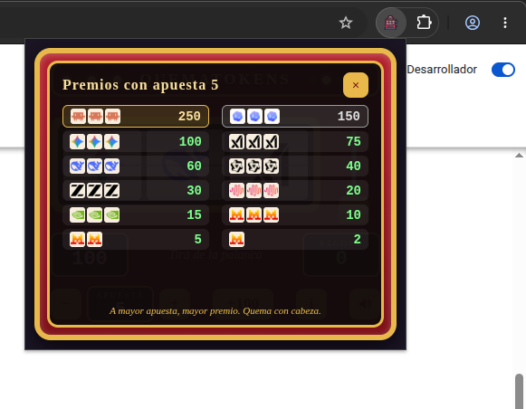

# QuemaTokens

**Tu agente está quemando tokens. Tú también deberías.**

QuemaTokens es una tragaperras clásica de palanca que vive en tu barra de
Chrome. Mientras esperas a que tu agente de IA termine de "pensar" (es decir,
de incinerar tu presupuesto a razón de varios céntimos por segundo), abres el
popup, tiras de la palanca y quemas tus propios tokens. Justicia poética.

  
  

## El problema (muy serio)

Has lanzado un refactor con tu agente favorito. La barra de progreso gira.
Los tokens arden. Tú miras la pantalla con cara de inversor en bolsa.
Esos 40 segundos de espera son, científicamente hablando, una eternidad.

## La solución (igual de seria)

Una máquina tragaperras donde los carretes son los logos de los modelos que
te están cobrando: Claude, Codex, Gemini, xAI, DeepSeek, Qwen, Z.ai, MiniMax,
NVIDIA y Mistral. Alinea tres Claude y gana el premio gordo: 250 tokens que
no valen absolutamente nada. Como los de verdad, pero más honestos.

## Características

- **Palanca real**: clic o arrastre hacia abajo, con su muelle y su sonido.
  La satisfacción mecánica que tu teclado ya no te da.
- **Apuesta variable**: 5, 10, 25 o 50 tokens por tirada. A mayor apuesta,
  mayor premio. El riesgo es mentira, pero la emoción es real.
- **Récord persistente**: presume de tu mejor premio. Nadie te lo va a
  preguntar, pero ahí está.
- **Recarga infinita**: botón `+100` sin tarjeta de crédito. El único
  proveedor de tokens del mercado que no factura.
- **Botón de silencio**: para jugar en reuniones. No lo decimos nosotros,
  lo dice tu historial.
- Todo persiste entre aperturas: tokens, apuesta, récord y silencio.

## Tabla de pagos (apuesta 5; escala con la apuesta)

| Combinación      | Premio |
|------------------|--------|
| 3 × Claude       | 250    |
| 3 × Codex        | 150    |
| 3 × Gemini       | 100    |
| 3 × xAI          | 75     |
| 3 × DeepSeek     | 60     |
| 3 × Qwen         | 40     |
| 3 × Z.ai         | 30     |
| 3 × MiniMax      | 20     |
| 3 × NVIDIA       | 15     |
| 3 × Mistral      | 10     |
| 2 × Mistral      | 5      |
| 1 × Mistral      | 2      |

Mistral es el símbolo más frecuente: aparece tanto que hasta pagamos por
verlo una sola vez.

## Instalación

Desde el zip de la release:

1. Descomprime `quematokens-x.y.z.zip` en una carpeta.
2. Abre `chrome://extensions` en Chrome.
3. Activa el "Modo de desarrollador" (esquina superior derecha).
4. Pulsa "Cargar descomprimida" y selecciona la carpeta descomprimida.
5. Ancla el icono a la barra y a quemar.

## Desarrollo

- Lógica del juego en `logic.js`, pura y sin DOM. Tests: `npm test`
  (node:test, cero dependencias, cero tokens).
- Probar sin instalar: servir la carpeta por HTTP y abrir `popup.html`.
- Regenerar iconos: `uv run --with pillow python tools/make_icons.py`.
- Empaquetar release: `bash tools/build_zip.sh`.

## Aviso legal con guiño

Los logos pertenecen a sus respectivos dueños y aquí se usan con cariño y
sin ánimo de lucro. QuemaTokens no fomenta el juego con dinero real: solo
con tokens imaginarios, que es como mejor se está.
